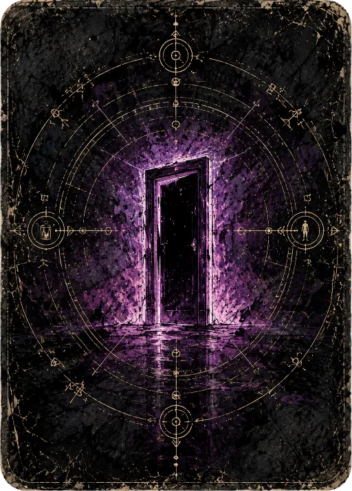
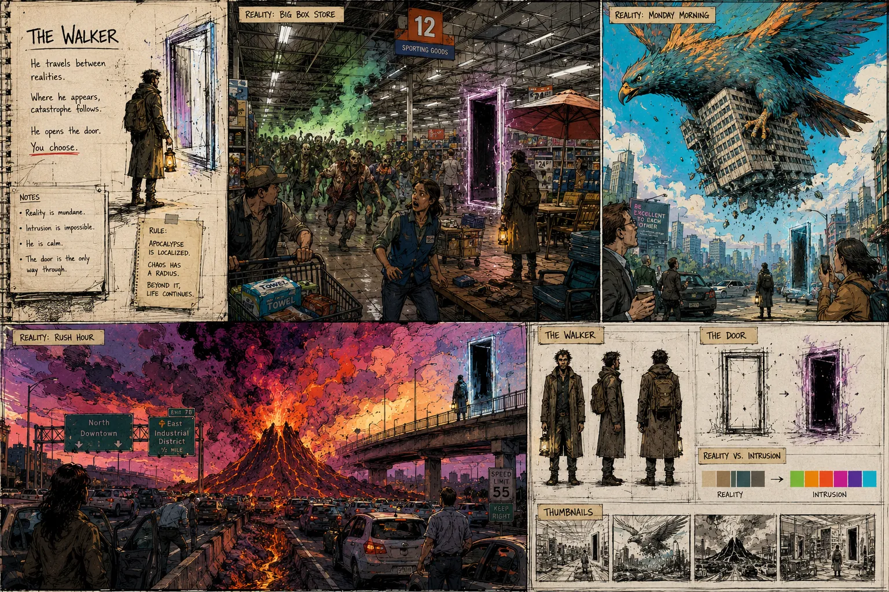

# Shattered Worlds - Visual Direction

<!--
date: 2026-06-04
status: current
tags: visual, art-direction, the-walker, intrusion, reference
fg-type: concept
fg-sources: .lore/work/specs/visual-identity.html, .lore/work/retros/visual-identity-rollout.html
fg-status: current
related: .lore/reference/vision.md
fg-evidence:
  code:
    - src/game/view/backdrop.ts
    - src/game/view/visualMappers.ts
    - src/game/view/themes/theme.ts
    - src/game/assets/cardback.webp
  tests:
    - src/game/tests/theme.test.ts
    - src/game/tests/visualMappers.test.ts
    - src/game/tests/walker.test.ts
  symbols:
    - intensity
    - VisualTheme
-->

**Visual North Star.** Current as of 2026-06-04.

Mundane reality rendered in ink and ash, broken open by a door of impossible color. The art's one job: make intrusion read as wrong the instant it appears.

## Identity

The figure on the concept sheet is The Walker: he travels between realities, and where he appears, catastrophe follows. He is weak. He opens the Door - and the Door is the only way through. The look hangs on a single contrast: **reality is mundane, intrusion is impossible**, and the picture must sell both at once.

The governing rule, lifted straight from the direction sheet: *apocalypse is localized.* Chaos has a radius. A giant raptor tears through a Monday-morning skyline while, a block away, life continues. That radius - the bleed from grey normalcy into saturated catastrophe - is the visual signature of the whole game.

- Mundane world
- The Walker arrives
- The Door opens
- Intrusion bleeds out
- You choose

## The Canon

Two locked assets. Everything new must look like it belongs beside these.

**Card back - production canon.** Distressed black stock, gold occult cartography (astrolabe rings, cardinal glyphs), a single violet doorway burning at center. Sets the card-back standard for every shard.

**Direction sheet - The Walker.** Character turnarounds, the Door studies, three reality variants (big-box store, Monday-morning raptor, rush-hour volcano), and the reality-to-intrusion palette ramp. The mood, line, and color logic all derive from here.

## What The Look Always Is

Tests an asset can pass or fail, not vibes.

### Look 1: Ink-and-ash linework, not clean vector

Heavy crosshatch, grain, and distress carry the base layer. Surfaces look **printed and weathered**, like a graphic novel left out in the rain. Flat, crisp, modern-flat-design rendering is off-brand.

### Look 2: Reality is desaturated; intrusion is the only true color

The mundane base sits in grey-greens and slate. Saturated color is a **scarce resource spent only on intrusion** - the Door, the catastrophe, the bleed. If everything is colorful, nothing reads as wrong.

### Look 3: Apocalypse is localized - show the radius

Catastrophe always has an edge. Compose so the **boundary between normal and broken is visible in frame**: shoppers beside the glow, traffic beneath the volcano. The contrast is the point; a fully-consumed frame loses it.

### Look 4: Occult cartography is the system's hand

Gold geometric line-work - rings, glyphs, sightlines - marks anything structural: card backs, frames, UI chrome. It's the game's diegetic skeleton, the **language of the Door and the Destiny**, distinct from the painted scene inside.

## The Reality-To-Intrusion Ramp

The single load-bearing element. Treat this ramp as the **master gradient every reality maps onto** - the shared color logic that makes distinct worlds feel like one game.

Reality is mundane, desaturated slate. Intrusion is impossible color, moving from magenta to ember.

It is **flavor, never game logic** - it never feeds back into rules or the deck. But it is not static: the renderer maps the core's pure `intensity` read-model onto this ramp, sliding the screen from mundane to intrusion as the run escalates. A dial the renderer turns from the game's state, never one the rules read back.

## Per-Reality Palettes

Each world keeps the grey base but claims its own intrusion hue, so realities stay distinct while sharing one logic.

#### Big-Box Store

Fluorescent dread. Toxic green intrusion glowing down retail aisles.

#### Monday Morning

Daylight blue normalcy ripped by a raptor; warm ember of falling debris.

#### Rush Hour

Dusk gridlock under a volcano. Magenta sky bleeding into lava orange.

#### The Door (constant)

Violet, everywhere. The Door carries the same hue across all realities - it is not of any world.

## What The Look Must Never Become

### Saturated everywhere

If the whole frame is vivid, intrusion stops reading as impossible. Color is rationed on purpose; spend it and the core contrast dies.

### Generic dark-fantasy

Skulls, runes-for-their-own-sake, grimdark-by-default. The horror here is the *mundane* broken, not a fantasy world that was always spooky.

### Clean flat-design UI

Crisp vector chrome fights the ink-and-ash world. UI is occult cartography on weathered stock, not a productivity app.

### Total-apocalypse splash

Frames consumed edge-to-edge by catastrophe. Without the radius - the surviving normal beside the chaos - the signature contrast is gone.

### AI-mush rendering

Smeared, detail-less, "no clear focal point" texture. Linework must be deliberate; the eye must land on the Door.

## Settled Direction

The three questions the look raised, now decided. These become the visual spec's opening agenda.

### Decided: Reality-to-intrusion is flavor, never game logic

Intrusion **never feeds back into rules or the deck** - it cannot change what is true in the game. But it tracks the run: the renderer drives backdrop intrusion from the core's pure `intensity` read-model, so the screen slides toward catastrophe as the game escalates. Flavor that follows the state, not a value the state reads back.

### Decided: Card fronts vary by reality-shard

The back is constant canon; **fronts are shard-themed**, each carrying its world's palette and intrusion hue. This is the visual half of *"worlds are identity, not wallpaper"* - the deck in your hand looks like the world you're standing in.

### Decided: The Walker is always present - distant until drawn

He's a **persistent figure in the background**, a person in the distance who drifts from scene to scene through the run. He is also in the deck: **the moment you draw him, the distance collapses** and he's right in front of you. Ambient dread made literal, and a card - which makes "the Walker" a deck mechanic the spec must define, not just art.

Captured 2026-06-04 from one production asset ([cardback](../assets/cardback.webp)) and one direction sheet ([The Walker](../assets/art-style.webp)), promoted out of `work/notes` into reference. Companion to [the project vision](vision.md): vision defines what the game *is*, this defines what it *looks like*. Status **current** - open when a visual decision feels wrong. It defines look, not requirements; the settled decisions above seed the visual spec - including the Walker, now a deck mechanic and not only a figure.
